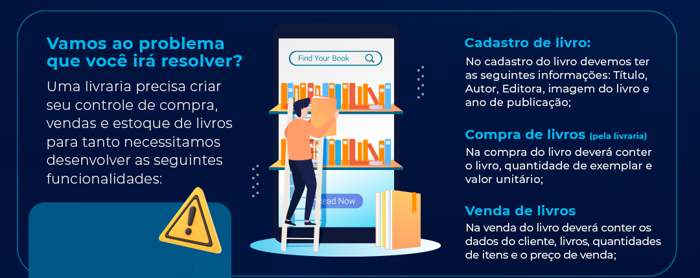

<a name="Bookstore"></a>

<br />
<div align="center">

  </svg>

  <h3 align="center">Bookstore</h3>

  <p align="center">
    An awesome project to TQI hiring process!
    <br />
    <a href="https://youtu.be/j_yY4SwN1u0">Vídeo do Protótipo</a>
    ·
    <a href="/issues">Reportar Bug</a>
  </p>
</div>


<details>
  <summary>Tabela de Conteúdo</summary>
  <ol>
    <li>
      <a href="#sobre-o-projeto">Sobre o Projeto</a>
      <ul>
        <li><a href="#construído-com">Construído com</a></li>
      </ul>
    </li>
    <li>
      <a href="#primeiros-passos">Primeiros passos</a>
      <ul>
        <li><a href="#contrato">Contrato</a></li>
        <li><a href="#prototipagem">Prototipagem</a></li>
      </ul>
    </li>
    <li><a href="#back-end">Back-End</a>
      <ul>
        <li><a href="#dependências-do-back">Dependências</a></li>
        <li><a href="#pré-requisitos">Pré Requisitos</a></li>
        <li><a href="#instalação">Instalação</a></li>
        <li><a href="#uso">Uso</a></li>
      </ul>
    </li>
    <li><a href="#front-end">Front-End</a></li>
      <ul>
        <li><a href="#dependências-do-front">Dependências</a></li>
        <li><a href="#pré-requisito">Pré Requisito</a></li>
        <li><a href="#instalação-do-front">Instalação</a></li>
        <li><a href="#uso-da-aplicação">Uso</a></li>
      </ul>
    </li>
    <li><a href="#contato">Contato</a></li>
  </ol>
</details>
<br>

## Sobre o Projeto

<div style="display: flex; flex-direction: column; align-items: center; gap: 1.2em; padding: 2em 0;">


Esse projeto foi realizado para a etapa de Teste de Código do Processo de Seleção da empresa TQI - _Tecnologia, Qualidade e Inovação._

<div style="display: flex; gap: 2em;">

### Construído com:

[![AdobeXD][AdobeXD]][AdobeXD-url]
[![React][React.js]][React-url]
[![Springboot][Springboot]][Springboot-url]

</div>

</div>


<p align="right">(<a href="#Bookstore">back to top</a>)</p>


## Primeiros passos

<div style=" padding: 1.2em 0">

Essa é a imagem que recebemos para o desenvolvimento do projeto:



</div>

### Então foi solicitado:

- Cadastrar Livro
- Comprar Livro
- Vender Livro

### Ou seja, no Back-end, precisaria, no mínimo, dos seguintes endpoints:

- `CREATE` Book
- `READ` Book (by ID)

- `CREATE` Purchase

- `CREATE` Order

### E no Front, as seguintes telas:

- Book List

- Book Register

- Purchase Register

- Order Register


Com essas informações, comecei a fazer o contrato...

<br>

## Contrato


- Create Book:
```
{
    "title": string,
    "author": string,
    "publisher": string,
    "publisherDate": number,
    "image": string
}
```


- Read Book:
```
{
    "id": uuid,
    "title": string,
    "author": string,
    "publisher": string,
    "publisherDate": number,
    "image": string,
    "inventory": number
}
```

- Create Purchase:
```
{
    "bookId": uuid,
    "unitValue": number,
    "amount": number,
}
```

- Create Order:
```
{
    "name": string,
    "document": string,
    "bookId": uuid,
    "unitValue": number,
    "amount": number,
}
```

> OBS: Essa lista é somente os requisitos mínimos para a execução do escopo que foi solicitado. Pois como diz um amigo meu: `Faça o simples, faça o necessário! SE sobrar tempo, você adiciona algo.`

<br>

<p align="right">(<a href="#Bookstore">back to top</a>)</p>


## Prototipagem

<div style="display: flex; flex-direction: column; gap: 1.2em; align-items: center; padding: 1.6em">

### Como venho do Designer e da construção de páginas com Adobe XD, WordPress e Elementor, escolhi fazer a prototipagem com o XD. 


### E sim... nessa parte eu mandei o escopo pra lua, hehe


</div>

Escolhi continuar o desenvolvimento do projeto a partir do Back-end...

<p align="right">(<a href="#Bookstore">back to top</a>)</p>

<br>


## Back-end

Nessa parte, fiz primeiro toda a classe de Book. Depois foi feito o restante das classes.

Consegues acompanhar a evolução do projeto através dos commits também.

> Por ter feito os commits em sub repositórios, quando uni os dois para enviar em um repositório único, só subiu a referência. Aí excluí eles e coloquei os arquivos todos aqui. Contudo, tenho a sequência inicial dos commits do Back aqui: https://github.com/ThiagoCostaBarbosa/book-store-tqi


### Dependências do Back

Essas são as dependências utilizadas no projeto:

* Spring Web
* Spring Validations
* Spring data JPA
* Spring Security
* Lombok
* PostgreSQL
* Swagger 3


### Pré-Requisitos

Antes de executar o projeto localmente (via IntelliJ), você precisará:


#### Lombok:

Baixe o plugin do Lombok acessando `File/Setting`. Na nova janela utilize a pesquisa e busque pela palavra `plugins`. Na consulta de plugins digite `lombok`. No resultado da pesquisa clique em `Install`.


#### Banco de dados:

Escolhi o PostgreSQL como banco de dados.

E para poder gerar um banco de dados com o Docker, acesse o diretório do projeto e execute o comando `docker-compose up`. 

Também é possível subir uma instalação própria do banco de dados sem utilizar `docker`. Neste caso, observe as configurações de porta e nome do banco no arquivo de configuração `application.yml`.

> Para usar o banco de dados dessa maneira, o `docker` e o `docker compose` também são uma dependência.

<p align="right">(<a href="#Bookstore">back to top</a>)</p>


### Instalação

1. Clone o repositório
   ```sh
   git clone https://github.com/ThiagoCostaBarbosa/tqi_evolution_fullstack_2022.git
   ```

2. Construa e Banco de dados com o arquivo `docker-compose.yml` via Docker

3. Construa a aplicação com o Graddle e execute o projeto (se fizer pelo IntelliJ é mais fácil pois ele faz esse processo automagicamente)


### Uso

Consegues testar os endpoints com o Swagger:

* http://localhost:8080/swagger-ui/index.html


E podes entrar no banco de dados criado, utilizando os seguintes dados:

* usuário: teste
* senha: teste


<div style="display: flex; flex-direction: column; gap: 1.2em; align-items: center; padding: 1.6em">


### Conseguimos concluir essa etapa!


Agora vamos para o Front...


</div>

<p align="right">(<a href="#Bookstore">back to top</a>)</p>


## Front-End

Nessa parte, fiz primeiro a navegação entre as páginas, depois as APis de conexão, e a visualização dos livros.


### Dependências do Front

Essas são as dependências utilizadas no projeto:

* React Router
* Axios
* React Query
* Format String By Pattern
* Styled Components
* React FontAwesome
* Material UI (importado, mas não deu tempo de utilizar)
* JSON Web Service


### Pré-requisito

JSON Server

Utilizei para mockar um server já populado a partir de um Json o JSON Server.
Para instalar ele, utilize o comando `npm install -g json-server`.


### Instalação do Front

1. Execute o comando `json-server -w data/db.json -p 8080` na pasta do projeto, para executar o JSON Server

2. Execute o comando `npm run build` na pasta do projeto, para baixar as dependências e compilar o projeto

3. Execute o comando `npm start` para dar início na aplicação.


## Uso da aplicação

Consegues abrir a aplicação em:

* http://localhost:3000

Possui as seguintes rotas implementadas:


* http://localhost:3000/books

* http://localhost:3000/books/register

* http://localhost:3000/orders/register

* http://localhost:3000/purchases/register


<div style="display: flex; flex-direction: column; gap: 1.2em; align-items: center; padding: 1.6em">

Sei que Ninguém constrói nada sozinho, especialmente na nossa área de TI, em que tudo muda tão rapidamente. Agradeço a todos os envolvidos no Bootcamp e no processo de Seleção, que dedicaram seu amor, inteligência e energia nesse trabalho. Vocês são a alma da empresa!

E como já dizia Alber Einstein:

> O único lugar onde sucesso vem antes do trabalho é no dicionário.

## #boraTrabalhar


## Contato

Thiago Costa Barbosa - [@thiagocostabarbosa](https://www.linkedin.com/in/ThiagoCostaBarbosa) - thiagocostabarbosa@live.com

</div>

<p align="right">(<a href="#Bookstore">back to top</a>)</p>

[product-screenshot]: images/screenshot.png
[React.js]: https://img.shields.io/badge/React-20232A?style=for-the-badge&logo=react&logoColor=61DAFB
[React-url]: https://reactjs.org/
[Springboot]: https://img.shields.io/badge/Spring-6DB33F?style=for-the-badge&logo=spring&logoColor=white
[Springboot-url]: https://spring.io/projects/spring-boot
[AdobeXD]: https://img.shields.io/badge/Adobe%20XD-470137?style=for-the-badge&logo=Adobe%20XD&logoColor=#FF61F6
[AdobeXD-url]: https://www.adobe.com/products/xd.html
